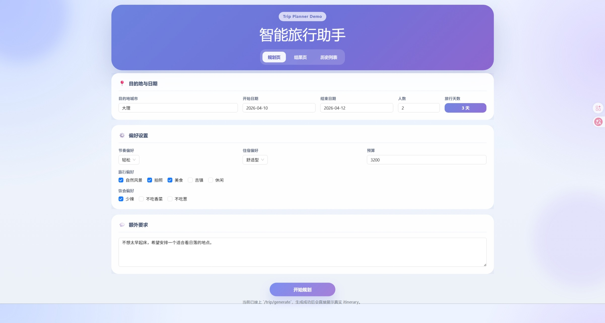

<div align="center">

# 🧳 TripCraft

**本地大模型驱动的智能旅行规划系统**

融合 **Ollama** 本地推理 · **Qdrant** 向量检索 · **RAG** 攻略增强 · **高德地图** 可视化，
输入目的地、日期、预算与偏好，一键生成结构化旅行方案。

**作者：**[LeonhardJY](https://github.com/LeonhardJY)

[](https://github.com/LeonhardJY)
[](https://github.com/LeonhardJY/TripCraft)
[](https://github.com/LeonhardJY/TripCraft/blob/main/CHANGELOG.md)

[快速启动](#-快速启动) · [技术栈](#-技术栈) · [架构](#-架构) · [界面预览](#-界面预览) · [API 接口](#-api-接口) · [配置](#-配置)

</div>

---

<div align="center">

### ✨ 技术栈

[](https://www.python.org)
[](https://fastapi.tiangolo.com)
[](https://vuejs.org)
[](https://www.typescriptlang.org)
[](https://ollama.com)
[](https://qdrant.tech)
[](https://www.sqlite.org)
[](https://www.docker.com)
[](https://lbs.amap.com)

</div>

---

<div align="center">

### 📸 界面预览

| 🗺️ 规划界面 | ✍️ 行程生成 |
|:---:|:---:|
|  |  |

| 💾 保存界面 | 📄 PDF 导出 |
|:---:|:---:|
|  |  |

</div>

---

## 🚀 快速启动

项目依赖 **Docker Desktop**（Qdrant）+ **Ollama**（本地大模型）。

### 1. 启动基础设施

```powershell
docker compose up -d qdrant
```

### 2. 确保 Ollama 已拉取模型

```powershell
ollama pull qwen2.5:3b
ollama pull nomic-embed-text
```

### 3. 启动后端

```powershell
cd backend
pip install -r requirements.txt
uvicorn app.api.main:app --host 0.0.0.0 --port 8000
```

首次使用需要将攻略入库：

```powershell
cd backend
python scripts/ingest_data.py
```

### 4. 启动前端

```powershell
cd frontend
npm install
npm run dev
```

### 🔗 访问地址

| 服务 | 地址 |
|------|------|
| 前端 | http://localhost:5173 |
| 后端 | http://localhost:8000 |
| API 文档 | http://localhost:8000/docs |

---

## 🧰 技术栈

| 层 | 技术 |
|---|------|
| 后端 | FastAPI + Pydantic + SQLAlchemy |
| 大模型 | **Ollama**（本地推理，完全免费） |
| 向量库 | **Qdrant**（Docker 容器化） |
| Embedding | **nomic-embed-text**（本地 274MB） |
| 外部服务 | 高德地图 Web 服务 + JavaScript API |
| 前端 | Vue 3 + Vite + Pinia + Vue Router |
| 数据库 | SQLite |

---

## 🏗️ 架构

### 分层

| 层级 | 关键文件 | 职责 |
|------|----------|------|
| 前端 | `frontend/src/views/` | 规划页、结果页、历史页 |
| 接口层 | `backend/app/api/routes/` | trip、export、weather 路由 |
| 服务层 | `backend/app/services/` | 城市解析、动态候选、行程编排、地图、缓存、导出 |
| Agent 层 | `backend/app/agents/` | LLM 行程生成、RAG 检索编排 |
| RAG 层 | `backend/app/rag/` | Qdrant 向量入库、检索、规则级重排序 |
| 数据层 | `backend/data/` | 6 城本地 Markdown 攻略 |

### 数据流

```
POST /trip/generate
  → city_resolver (A: curated / B: dynamic)
    → rag_tool.py + retriever.py (Qdrant 向量检索)
    → trip_planner_agent.py (Ollama qwen2.5:3b 生成)
    → map_service.py (高德地图 POI + 路线)
    → weather_service.py (天气预报)
    → 预算拆分
    → 返回 Itinerary
```

### Docker 服务

```
Qdrant → :6333 (向量数据库)
Ollama → :11434 (大模型推理)
Redis  → :6379 (可选缓存)
```

---

## 📁 项目结构

```
TripCraft/
├── backend/
│   ├── app/
│   │   ├── config.py              # 环境变量配置
│   │   ├── agents/                # LLM 行程生成 + RAG 工具
│   │   ├── api/routes/            # trip, export, weather 路由
│   │   ├── models/                # Pydantic + SQLAlchemy 模型
│   │   ├── rag/                   # Qdrant 向量库 + 检索 + Rerank
│   │   └── services/              # 10 个服务模块
│   ├── data/                      # 6 城 Markdown 攻略
│   ├── scripts/                   # 入库、调试、评估脚本
│   └── tests/                     # pytest 测试
├── frontend/
│   ├── src/
│   │   ├── views/                 # HomeView, ResultView, HistoryView
│   │   ├── components/            # AppHeader, TripForm, TripMap 等
│   │   ├── stores/trip.ts         # Pinia 状态管理
│   │   ├── router/index.ts        # Vue Router 配置
│   │   └── services/api.ts        # Axios 封装
│   └── package.json
├── docker-compose.yaml
├── README.md
└── CHANGELOG.md
```

---

## 🔌 API 接口

| 方法 | 路径 | 说明 |
|------|------|------|
| GET | `/` | 服务检查 |
| GET | `/health` | 健康检查 |
| POST | `/trip/generate` | 生成行程 |
| POST | `/trip/edit` | 智能编辑行程 |
| POST | `/trip/save` | 保存行程 |
| GET | `/trip` | 历史列表 |
| GET | `/trip/{trip_id}` | 行程详情 |
| DELETE | `/trip/{trip_id}` | 删除行程 |
| GET | `/export/{trip_id}/pdf` | 导出 PDF |
| GET | `/weather/forecast` | 天气查询 |

---

## ⚙️ 配置

### 后端 `backend/.env`

```env
# LLM — Ollama 本地模型
LLM_MODEL=qwen2.5:3b
LLM_BASE_URL=http://localhost:11434/v1
LLM_TIMEOUT_SECONDS=300

# RAG / Qdrant
QDRANT_URL=http://localhost:6333
QDRANT_COLLECTION_NAME=travel_guides
EMBEDDING_MODEL=nomic-embed-text

# 高德地图
AMAP_API_KEY=your_web_service_key
ENABLE_AMAP_ENRICHMENT=true
```

### 前端 `frontend/.env`

```env
VITE_API_BASE_URL=http://127.0.0.1:8000
VITE_AMAP_JS_KEY=your_javascript_api_key
```

---

## 🎨 设计主题

- **背景色**：#F4F1EA 暖奶油白
- **强调色**：#D97757 珊瑚橙
- **展示字体**：Instrument Serif（衬线）
- **正文字体**：Inter（无衬线）
- 支持亮/暗双模式切换

---

## 📦 数据边界

- 6 个本地 Markdown 攻略用于 RAG 参考
- 动态城市实体来自高德 POI 候选
- 价格与营业状态未经实时核验，金额为规划估算
